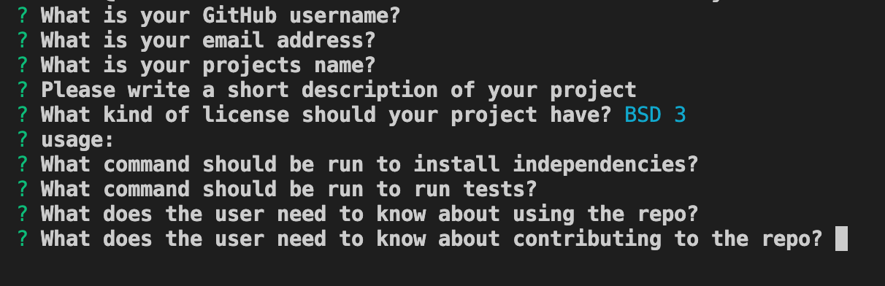

# README Generator 

  

  ## Description

  This project generates a proffessional README for developers to use for their projects. A user should run npm i to install independencies before using this generator. Once they have that installed, when they run index node.js in their terminal on Visual Studio Code, they will be prompted to answer questions and their inputs will be used in the generated README.

  ## Table of Contents

  * [Installation](#installation)

  * [Usage](#usage)

  * [License](#license)

  * [Contributing](#contributing)

  * [Tests](#tests)

  * [Questions](#questions)

  ## Installations 

  For installations of independencies run this command in the terminal - npm i

  ## Usage

  Steps:

  1. Install independencies using - npm i
  2. To initialize the app, use the terminal in Visual Studio Code
  3. Run this command in the terminal - node index.js
  4. Answer all prompts and the README will be generated for you!

  

  ## License 

  GPL 3.0

  For more information click on the license icon under the title.

  ## Contributing Guidelines 

  Before making any contributions please email me for approval of the contribution.

  ## Tests

  To run tests on this app use - npm test

  ## Questions 

  For more information about me check out my github at https://github.com/marksely. 
  
  For any questions regarding this repository or how to use this generator please email me at mark.sel9@gmail.com.

